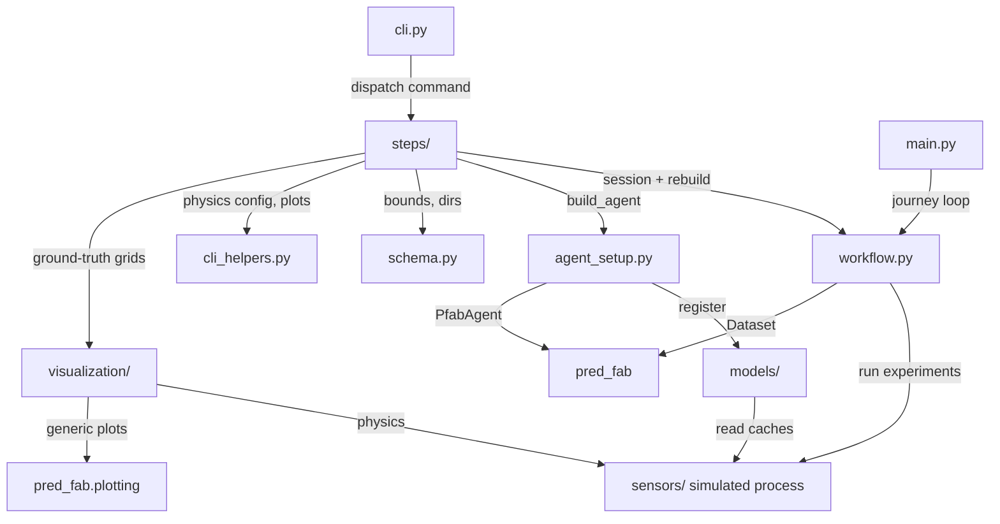

# pred-fab-mock — Project Context

## Purpose
Self-contained showcase of the full PFAB journey (baseline → exploration → inference) using a simulated extrusion printing process.

**Owns:** the simulated process (sensors + physics), mock-specific feature/evaluation/prediction models, the demo CLI and its plots.
**Out of scope → who:** generic plotting, agent/calibration/optimizer logic → `pred-fab` (pred-fab agent); changes there go via handoff cards.
**Depends on:** `pred-fab` git dep pinned `@main` (see [[Repo Dependency Graph]]).

## Structure

| File / Folder | Description |
|---|---|
| `main.py` | End-to-end journey script: baseline → training → exploration → single-shot inference |
| `cli.py` | Step-by-step CLI with JSON session persistence |
| `steps/` | One module per CLI command + shared step infrastructure (see `steps/STEPS_CONTEXT.md`) |
| `workflow.py` | Journey helpers: `JourneyState`, `run_and_evaluate`, `with_dimensions`, `clean_artifacts` |
| `schema.py` | `build_schema()` → DatasetSchema; single home for parameter bounds, default weights, artefact dirs |
| `agent_setup.py` | `build_agent()` → configured PfabAgent |
| `cli_helpers.py` | Inline plot display, physics randomization, test-set generation, local sensitivity |
| `utils.py` | Small helpers: `params_from_spec`, `get_performance` |
| `sensors/` | Simulated sensor systems (camera, energy) and physics engine |
| `models/` | Feature models, linear target/scale evaluation models, prediction models |
| `visualization/` | Mock-specific plots: physics ground-truth grid + optimum, 3D filament view, journey plot |
| `dev/` | Progressive validation scripts (see `dev/DEV_CONTEXT.md` for per-script status) |

## Key Points
- Schema v9: single design (non-linear curvature) × single material (clay). 2 continuous parameters (water_ratio, print_speed; bounds live in `schema.py`). Spatial domain: n_layers design-intent [4..8] × 4 segments; the journey pins n_layers=5 via fixed params.
- Physics defaults put the optimum near speed 40 mm/s / water 0.42, with a Pareto conflict between path_accuracy, energy_efficiency, and production_rate; `init-physics` randomizes constants per session (see `sensors/SENSORS_CONTEXT.md`).
- Calibration weights: path_accuracy=2, energy_efficiency=1, production_rate=1.
- Optimizer (pred-fab main): Sobol candidates + multi-start local optimizer (`configure_optimizer(n_starts, n_sobol, lr)`); acquisition blends predicted performance with evidence gain (κ).
- Trajectory mode: virtual KDE points for within-trajectory spacing + smoothing penalty for monotonic trajectories.
- Inference is single-shot (first-time-right manufacturing), not iterative.

## Open Risks
- `dev/` scripts largely target a pre-rename pred-fab API — per-script status in `dev/DEV_CONTEXT.md`.
- `adapt` crashes upstream: `pred_system.tune()` uses `forward_pass`, unsupported by `TransformerModel` multi-depth outputs.
- Acquisition over variable `n_layers` crashes upstream (TransformerModel lacks variable-length sequences) — all acquisition paths must pin `n_layers` until that lands.
