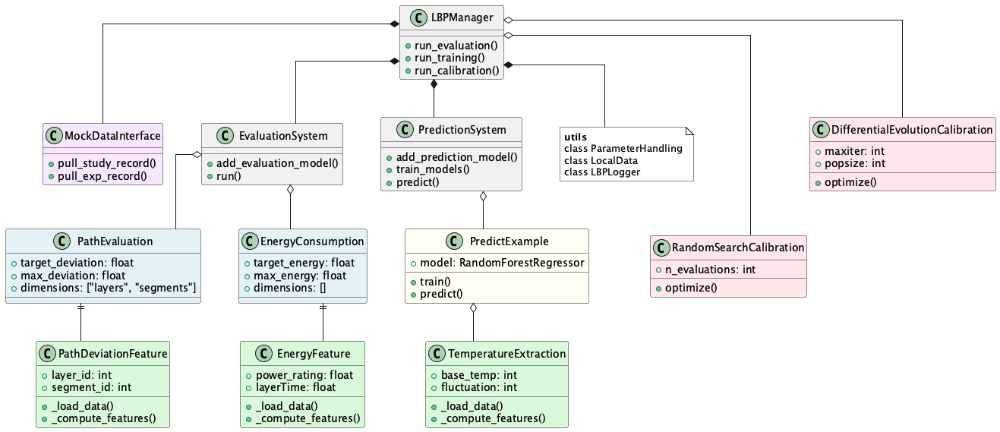

# LBP Examples Repository

Complete working implementations of the Learning by Printing (LbP) Framework demonstrating real domain-specific integrations for manufacturing process optimization.

## Table of Contents

- [Overview](#overview)
- [Repository Structure](#repository-structure)
- [Architecture Overview](#architecture-overview)
- [Quick Start - Run the Complete Example](#quick-start---run-the-complete-example)
  - [Prerequisites](#prerequisites)
  - [Installation](#installation)
  - [Run the Example](#run-the-example)
- [Implementation Examples](#implementation-examples)
  - [MockDataInterface](#mockdatainterface)
  - [PathEvaluation & PathDeviationFeature](#pathevaluation--pathdeviationfeature)
  - [EnergyConsumption & EnergyFeature](#energyconsumption--energyfeature)
  - [PredictExample](#predictexample)
  - [Calibration Examples](#calibration-examples)
- [Test Data Structure](#test-data-structure)
- [Running Different Workflows](#running-different-workflows)
- [Configuration](#configuration)
- [Key Implementation Patterns](#key-implementation-patterns)
- [Utility Functions](#utility-functions)
- [Next Steps](#next-steps)

## Overview

This examples repository demonstrates concrete implementations of the LBP Framework interfaces with working code for geometric evaluation and energy analysis. Each example shows how to integrate the framework with manufacturing processes through real domain-specific implementations.

**Key Learning Objectives:**
- See complete interface implementations in action
- Understand multi-dimensional vs. scalar evaluation patterns
- Learn database integration approaches
- Explore ML prediction workflows
- Compare different optimization strategies

## Repository Structure

```
lbp_package_example/
├── main.py                    # Main execution script - complete workflow
├── implementations/           # Interface implementations
│   ├── __init__.py           # Package initialization with clean imports
│   ├── external_data.py      # MockDataInterface (IExternalData)
│   ├── evaluation/           # Evaluation models and their feature models
│   │   ├── __init__.py
│   │   ├── geometry.py       # PathEvaluation + PathDeviationFeature
│   │   └── energy.py         # EnergyConsumption + EnergyFeature
│   ├── prediction.py         # PredictExample (IPredictionModel)
│   └── calibration.py        # Optimization models (ICalibrationModel)
├── utils/                    # Utility functions
│   ├── mock_data.py          # Test data generation utilities
│   └── visualize.py          # Visualization helper functions
└── UML_diagram.png          # Architecture diagram

# Created at runtime when executing main.py:
# ├── local/                  # Data storage directory
# │   └── test/               # Study data (JSON files and arrays)
# └── logs/                   # Execution logs
```

## Architecture Overview



This diagram shows the concrete implementations of the LBP framework interfaces, demonstrating how abstract contracts are fulfilled with working code.

### Organized Interface Implementations

The `implementations/` folder provides a clean, organized structure for all LBP framework interface implementations:

| Folder/File | Purpose | Contains |
|-------------|---------|----------|
| `implementations/__init__.py` | Central imports | Clean import statements for all implementations |
| `implementations/external_data.py` | Data interface | `MockDataInterface` (IExternalData) |
| `implementations/evaluation/` | Evaluation models | All evaluation and feature model pairs |
| `implementations/evaluation/geometry.py` | Geometric analysis | `PathEvaluation` + `PathDeviationFeature` |
| `implementations/evaluation/energy.py` | Energy analysis | `EnergyConsumption` + `EnergyFeature` |
| `implementations/prediction.py` | ML models | `PredictExample` (IPredictionModel) |
| `implementations/calibration.py` | Optimization | Multiple calibration algorithms |

**Import Pattern:**
```python
# Clean single import for all implementations
from implementations import (
    EnergyConsumption, PathEvaluation, PredictExample,
    MockDataInterface, RandomSearchCalibration, DifferentialEvolutionCalibration
)
```

## Quick Start - Run the Complete Example

### Prerequisites
- Python 3.9+
- LBP Package framework installed

### Installation

1. Install uv if you haven't already:
```bash
curl -LsSf https://astral.sh/uv/install.sh | sh
```

2. Clone this repository:
```bash
git clone https://gitlab.lrz.de/luca_bettermann/lbp_package_example.git
cd lbp_package_example
```

3. Install the project and dependencies:
```bash
uv sync
```

4. Install the LBP Package framework:
```bash
uv add git+https://gitlab.lrz.de/luca_bettermann/lbp_package.git
```

### Run the Example

```bash
# Navigate to examples directory
cd examples

# Run the complete workflow
python main.py
```

This will execute the complete learning workflow using the pre-configured test data, demonstrating evaluation, prediction, and calibration.

### Understanding the Main Workflow

The `main.py` script demonstrates the complete Learning by Printing workflow through a series of systematic steps. The framework automatically logs all operational steps in detail and saves crucial data locally in a `local/` folder. Additionally, console outputs summarize the process, allowing users to track what is happening at different levels of granularity:

**Monitoring Levels**: Console → Logs → Local Files
- **Console**: High-level progress summaries with ✅ success indicators
- **Logs**: Detailed operational steps and debug information  
- **Local Files**: Complete data persistence (JSON records, arrays, results)

**High-Level Workflow Steps:**

| Step | Phase | Key Method Calls | Purpose | Console Output | Data Created |
|------|-------|------------------|---------|----------------|--------------|
| **1. Setup & Initialization** | Framework Setup | `LBPManager(...)` → `add_evaluation_model()` → `add_prediction_model()` → `initialize_for_study()` | Configure framework, register models, and initialize study | "Welcome to Learning by Printing" → "Added evaluation model" → "Study Initialization" | Log session + model registry + `local/test/study_record.json` |
| **2. Evaluation** | Performance Assessment | `run_evaluation("test", exp_nr=1)` → `run_evaluation("test", exp_nrs=[2,3])` | Execute feature extraction and performance evaluation for experiments | "Evaluation of 1 Experiment" → "Evaluation of 2 Experiments" | `local/test/test_00X/` folders + feature arrays + performance arrays |
| **3. Prediction** | ML Training | `run_training("test", exp_nrs=[1,2,3])` | Train machine learning models on evaluation results | "Run Training for 3 Experiments" | Trained model states + performance predictions |
| **4. Calibration** | Process Optimization | `set_calibration_model()` → `run_calibration(exp_nr=4, param_ranges=...)` | Configure and execute optimization algorithms to find optimal parameters | "Set calibration model" → "Run Calibration for Experiment" | Optimal parameters + comparative optimization results |

**Key Framework Benefits:**
- **Automatic Orchestration**: Framework handles data flow between evaluation → prediction → calibration
- **Multi-Level Monitoring**: Track progress from high-level console to detailed logs and persistent data
- **Incremental Workflow**: Each step builds on previous results, supporting iterative development
- **Flexible Optimization**: Easy comparison of different optimization algorithms

## Implementation Examples


## Test Data Structure

The `local/test/` directory contains the complete data structure for standalone operation. **Note**: This data structure is automatically created during the first run of `main.py` - the framework pulls data from the `MockDataInterface` and saves it locally for future use.

### Study Record (`local/test/study_record.json`)
```json
{
  "id": 0,
  "Code": "test",
  "Parameters": {
    "target_deviation": 0.0,
    "max_deviation": 5.0,
    "target_energy": 0.0,
    "max_energy": 10000.0,
    "power_rating": 50.0
  },
  "Performance": [
    "path_deviation",
    "energy_consumption"
  ]
}
```

### Experiment Records (`local/test/test_00X/exp_record.json`)
**Creation**: Experiment folders and records are created automatically when `run_evaluation()` is called for each experiment number.

Each experiment folder contains:
- `exp_record.json` - Experiment parameters and metadata (from MockDataInterface)
- Raw data files (loaded by feature models during evaluation) 
- `arrays/` - Generated feature and performance arrays (created during evaluation)
- Result files (aggregated metrics, predictions, etc. - created as workflows progress)

Example experiment record:
```json
{
  "id": 1,
  "Code": "test_001", 
  "Parameters": {
    "n_layers": 2,
    "n_segments": 2,
    "layerTime": 30.0,
    "layerHeight": 0.2
  }
}
```

**Key Learning**: This data structure demonstrates the framework's hierarchical organization and shows how parameters flow from records to model instances. The framework's **hierarchical data loading** (memory → local → external) means that once data is created locally, subsequent runs will use the cached local files instead of querying the external interface again.

## Running Different Workflows

You can run individual components of the workflow:

```python
# Evaluation only
lbp_manager.run_evaluation("test", exp_nrs=[1])

# Training only (requires existing evaluation results)  
lbp_manager.run_training("test", exp_nrs=[1, 2, 3])

# Calibration only (requires trained prediction models)
lbp_manager.run_calibration(exp_nr=4, param_ranges={"layerTime": (0.0, 1.0)})

# Flag overrides
lbp_manager.run_evaluation("test", exp_nrs=[1], 
                          debug_flag=True,      # Skip external data
                          visualize_flag=False,  # No visualization
                          recompute_flag=True)   # Force recomputation
```

## Next Steps

### Customization Roadmap

| Step | Component | Action | Purpose |
|------|-----------|--------|---------|
| 1 | **Feature Models** | Modify `PathDeviationFeature` and `EnergyFeature` | Load your domain-specific data formats |
| 2 | **Evaluation Logic** | Adjust dimensions, target values and scaling factors | Match your performance requirements |
| 3 | **Database Integration** | Replace `MockDataInterface` | Connect to your actual data sources |
| 4 | **ML Models** | Experiment with different algorithms | Improve prediction accuracy |
| 5 | **Optimization** | Implement domain-specific algorithms | Optimize for your process constraints |

### Development Workflow

1. **Start with Examples**: Run the complete example to understand the workflow
2. **Adapt Incrementally**: Modify one component at a time while keeping others working
3. **Test Frequently**: Use the provided test data to validate each change
4. **Scale Gradually**: Add complexity (dimensions, models, algorithms) progressively

## Key Features

- **Complete Working Examples**: Real implementations demonstrating all framework interfaces
- **Multi-Dimensional Analysis**: Compare 0D (scalar) vs. 2D (layered) evaluation patterns
- **Database Independence**: Works with mock data interface, easily replaceable
- **ML Integration**: Random Forest prediction with performance metric forecasting  
- **Multiple Optimizers**: Random search and differential evolution implementations
- **Visualization Support**: Built-in plotting for geometric and thermal analysis

## Support

- **LBP Framework Documentation**: [Main Repository](https://gitlab.lrz.de/cms/dev/robotlab/learning-by-printing/lbp_package) - Core framework APIs and concepts
- **Framework Installation**: See installation instructions in the main LBP package repository

## Implementation Examples

### MockDataInterface

**Purpose**: Shows how to integrate with external data sources. External data interface allows integration with existing databases/APIs while maintaining framework independence.

**Key Methods:**

| Method | Description | Returns | Example Data |
|--------|-------------|---------|--------------|
| `pull_study_record(study_code)` | Returns hardcoded study configuration | Dict with study parameters and performance metrics | Study metadata with target values |
| `pull_exp_record(exp_code)` | Maps experiment codes to parameter sets | Dict with experiment-specific parameters | `test_001: [2, 2, 30.0, 0.2]` |

**Complete Implementation:**
```python
class MockDataInterface(IExternalData):
    def pull_study_record(self, study_code: str) -> Dict[str, Any]:
        # Return hardcoded study data with proper structure
        return {
            "id": 0,
            "Code": study_code,
            "Parameters": {        
                "target_deviation": 0.0,
                "max_deviation": 5.0,
                "target_energy": 0.0,
                "max_energy": 10000.0,
                "power_rating": 50.0
            },
            "Performance": ["path_deviation", "energy_consumption"]
        }
    
    def pull_exp_record(self, exp_code: str) -> Dict[str, Any]:
        # Map experiment codes to parameter combinations
        params = {
            'test_001': [2, 2, 30.0, 0.2],  # n_layers, n_segments, layerTime, layerHeight
            'test_002': [3, 4, 40.0, 0.3], 
            'test_003': [4, 3, 50.0, 0.4],
        }
        return {
            "id": int(''.join(filter(str.isdigit, exp_code))),
            "Code": exp_code,
            "Parameters": {
                "n_layers": params[exp_code][0],
                "n_segments": params[exp_code][1], 
                "layerTime": params[exp_code][2],
                "layerHeight": params[exp_code][3]
            }
        }
```

### PathEvaluation & PathDeviationFeature

**Purpose**: Demonstrates **multi-dimensional evaluation** with automatic array management. Framework automatically creates 2D arrays `[n_layers, n_segments]` and iterates through all combinations `(layer_id, segment_id)`.

**Dimensional Configuration:**

| Property | Value | Description |
|----------|-------|-------------|
| `dim_names` | `['layers', 'segments']` | Creates 2D array structure |
| `dim_param_names` | `['n_layers', 'n_segments']` | Must match exp record fields |
| `dim_iterator_names` | `['layer_id', 'segment_id']` | Must match dim_parameter names |
| `feature_model_type` | `PathDeviationFeature` | Associated feature model |
| `target_value` | `self.target_deviation` | Performance target |

**Complete Implementation:**
```python
@dataclass
class PathEvaluation(IEvaluationModel):
    # Study parameters (constant across experiments)
    target_deviation: float = study_parameter(default=0.1)
    max_deviation: float = study_parameter()
    
    # Experiment parameters (define array dimensions)
    n_layers: int = exp_parameter()
    n_segments: int = exp_parameter()
    
    # Dimension parameters (track current position during iteration)
    layer_id: int = dim_parameter()
    segment_id: int = dim_parameter()
    
    # Required dimension configuration
    @property
    def dim_names(self) -> List[str]:
        return ['layers', 'segments']
    
    @property
    def dim_param_names(self) -> List[str]:
        return ['n_layers', 'n_segments']  # Must match exp record fields
    
    @property  
    def dim_iterator_names(self) -> List[str]:
        return ['layer_id', 'segment_id']  # Must match dim_parameter names
    
    @property
    def feature_model_type(self) -> Type[IFeatureModel]:
        return PathDeviationFeature  # Associated feature model
    
    @property
    def target_value(self) -> float:
        return self.target_deviation  # Performance target
```

### EnergyConsumption & EnergyFeature

**Purpose**: Demonstrates **0-dimensional evaluation** (single aggregated metric). Compare with PathEvaluation - same interface, but 0-dimensional vs 2-dimensional evaluation.

**Dimensional Configuration:**

| Property | Value | Description |
|----------|-------|-------------|
| `dim_names` | `[]` | Empty = single aggregated value |
| `dim_param_names` | `[]` | No dimensions |
| `dim_iterator_names` | `[]` | No iteration needed |
| `target_value` | `self.target_energy` | Performance target |
| `scaling_factor` | `self.max_energy` | Optional: provides normalization |

**Complete Implementation:**
```python
@dataclass
class EnergyConsumption(IEvaluationModel):
    # Study parameters
    target_energy: float = study_parameter(0.0)
    max_energy: float = study_parameter()
    
    # No dimension configuration (0-dimensional)
    @property
    def dim_names(self) -> List[str]:
        return []  # Empty = single aggregated value
    
    @property
    def dim_param_names(self) -> List[str]:
        return []  # No dimensions
    
    @property
    def dim_iterator_names(self) -> List[str]:
        return []  # No iteration needed
    
    @property
    def target_value(self) -> float:
        return self.target_energy
    
    @property
    def scaling_factor(self) -> float:
        return self.max_energy  # Optional: provides normalization
```

### PredictExample

**Purpose**: Demonstrates machine learning integration for performance prediction. Framework handles feature extraction and data preparation. You focus on ML model training and prediction logic.

**Configuration:**

| Property | Value | Description |
|----------|-------|-------------|
| `input` | `["layerTime", "layerHeight", "temperature"]` | Input features for ML model |
| `dataset_type` | `AGGR_METRICS` | Uses aggregated performance metrics |
| `model` | `RandomForestRegressor` | ML algorithm implementation |

**Complete Implementation:**
```python
class PredictExample(IPredictionModel):
    def __init__(self, **kwargs):
        super().__init__(**kwargs)
        self.model = RandomForestRegressor(n_estimators=100, random_state=42)
        
    @property
    def input(self) -> List[str]:
        return ["layerTime", "layerHeight", "temperature"]  # Input features
        
    @property
    def dataset_type(self) -> IPredictionModel.DatasetType:
        return IPredictionModel.DatasetType.AGGR_METRICS  # Use aggregated metrics
    
    def train(self, X: np.ndarray, y: np.ndarray) -> Dict[str, Any]:
        self.model.fit(X, y)
        r2_score = self.model.score(X, y)
        return {
            "training_score": r2_score,
            "training_samples": len(X)
        }
    
    def predict(self, X: np.ndarray) -> np.ndarray:
        return self.model.predict(X)
```

### Calibration Examples

**Purpose**: Framework provides objective function based on evaluation model weights. You implement the optimization algorithm of choice.

**Two Optimization Approaches:**

| Model | Algorithm | Key Parameters | Use Case | Implementation |
|-------|-----------|----------------|----------|----------------|
| `RandomSearchCalibration` | Random Search | `n_evaluations` | Quick exploration, baseline results | Try n_evaluations random points, return best |
| `DifferentialEvolutionCalibration` | Differential Evolution | `maxiter`, `popsize` | Advanced optimization, better convergence | Uses scipy's differential evolution |

**Complete Implementations:**

#### Random Search Calibration
```python
class RandomSearchCalibration(ICalibrationModel):
    def optimize(self, param_ranges: Dict[str, Tuple[float, float]], 
                 objective_fn: Callable[[Dict[str, float]], float]) -> Dict[str, float]:
        # Try n_evaluations random points, return the best
        best_params = None
        best_objective = float('-inf')
        
        for params in ParameterSampler(param_dists, n_iter=self.n_evaluations):
            objective_val = objective_fn(params)
            if objective_val > best_objective:
                best_objective = objective_val
                best_params = params.copy()
        
        return best_params
```

#### Differential Evolution Calibration  
```python
class DifferentialEvolutionCalibration(ICalibrationModel):
    def optimize(self, param_ranges: Dict[str, Tuple[float, float]], 
                 objective_fn: Callable[[Dict[str, float]], float]) -> Dict[str, float]:
        # Use scipy's differential evolution directly
        def scipy_objective(x):
            params = dict(zip(param_ranges.keys(), x))
            return -objective_fn(params)  # Scipy minimizes, we maximize
            
        result = differential_evolution(
            scipy_objective, 
            bounds=list(param_ranges.values()),
            maxiter=self.maxiter
        )
        return dict(zip(param_ranges.keys(), result.x))
```

## Configuration

The framework uses **programmatic configuration** without configuration files. All models are registered directly in code:

```python
# Register evaluation models with calibration weights
lbp_manager.add_evaluation_model("energy_consumption", EnergyConsumption, weight=0.3)
lbp_manager.add_evaluation_model("path_deviation", PathEvaluation, weight=0.7)

# Register prediction model for multiple performance metrics
lbp_manager.add_prediction_model(["energy_consumption", "path_deviation"], PredictExample)

# Register calibration model with parameters
lbp_manager.set_calibration_model(RandomSearchCalibration, n_evaluations=100)
```

## Key Implementation Patterns

### Parameter Management

**Parameter Types:**

| Decorator | Purpose | Scope | Example |
|-----------|---------|--------|---------|
| `@study_parameter()` | Constants across experiments | Study-wide configuration | `target_deviation = study_parameter(0.1)` |
| `@exp_parameter()` | Varies between experiments | Experiment-specific settings | `layer_time = exp_parameter()` |
| `@dim_parameter()` | Changes during execution | Runtime position tracking | `layer_id = dim_parameter()` |

### Data Loading Patterns

**Required Methods:**

| Interface | Method | Purpose | Returns | Use Case |
|--------|--------|---------|---------|------------------|
| `IExternalData` | `pull_study_record()`, `pull_exp_records()` | Load structured parametrical dat | Dictionariy | Metadata, Parameters |
| `IFeatureModel` | `_load_data()` | Load domain-specific raw data | Any format | CAD files, sensor streams, images |

## Utility Functions

The examples include helper utilities in the `utils/` directory:
- `mock_data.generate_path_data()` - Creates mock geometry data with optional noise
- `mock_data.generate_temperature_data()` - Creates mock sensor data  
- `visualize.visualize_geometry()` - Visualization tools for path analysis
- `visualize.plot_temperature_data()` - Temperature data visualization

## Next Steps

1. **Customize Data Interface**: Replace `MockDataInterface` with your actual data source (database, API, files)
2. **Implement Domain Models**: Create evaluation and feature models for your specific use case
3. **Customize Data Loading**: Modify `_load_data()` methods to handle your data formats
4. **Add Prediction Models**: Implement ML models suited for your performance metrics
5. **Setup Calibration**: Choose and configure optimization algorithms for your parameter spaces
6. **Scale Dimensionality**: Extend dimension configuration to match your analysis structure

For detailed framework documentation, see the [LBP Package Framework](https://github.com/your-org/lbp-package) repository.