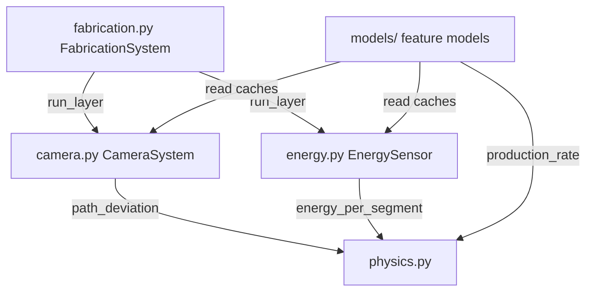

# sensors/ — Context

## Purpose
Simulates the sensor systems of the extrusion printing rig. All physics is deterministic; sensor noise is reproducible via a fixed random seed.

## Structure

| Module | Class | Description |
|---|---|---|
| `physics.py` | — | Pure physics: `path_deviation`, `energy_per_segment`, `production_rate` + module-level constants |
| `_segment_sensor.py` | `_SegmentSensor` | Abstract base: per-(params, layer, segment) cache + `run_layer` iteration; subclasses implement `_simulate_segment` |
| `camera.py` | `CameraSystem` | Simulates camera readings; caches `{measured_path, designed_path}` per (layer, segment) |
| `energy.py` | `EnergySensor` | Simulates energy meter; caches `{energy_per_segment}` per (layer, segment) |
| `fabrication.py` | `FabricationSystem` | Coordinates camera+energy for one experiment or layer-by-layer |

## Key Points
- **The physics values below are `physics.py` defaults** — `init-physics` (`cli_helpers.randomize_physics`) rebinds them per session, so a live session's constants generally differ.
- Default optimum: speed ≈ 40 mm/s, water ≈ 0.42.
- **Shear-thinning coupling**: water optimum shifts with speed — creates a diagonal valley in (speed, water) space.
- **Segment curvature**: `DEFAULT_SEGMENT_CURVATURE` (0.85, 1.15, 0.95, 1.05) is the immutable pristine default; the module-level `SEGMENT_CURVATURE` is the rebindable live value. The alternating pattern creates segment-dependent deviation behaviour.
- `PATH_SAMPLES` / `SAMPLE_SPACING` define the segment sample geometry shared by the camera and the 3D plots.
- **Pareto conflict**: `W_ENERGY_OPT` (0.38) ≠ `W_OPTIMAL` (0.42) — minimising deviation and energy require different water ratios.
- **Smooth adhesion sigmoid**: deviation rises steeply but continuously above `ADHESION_SPEED` (52 mm/s).
- **Nozzle-slip production rate**: rate collapses above `W_SLIP` (0.45) using a quadratic penalty.
- Layer drift amplifies speed error with layer index. Optimal speed shifts +0.4 mm/s/layer (clay softens); energy decreases with layers (−0.012 J/layer, clay dries).
- Sensors cache by parameter+position tuple key; re-calls are free.
- `run_experiment()` populates the full cache; `run_layer()` fills one layer so online adaptation can interleave sensing with agent decisions.
