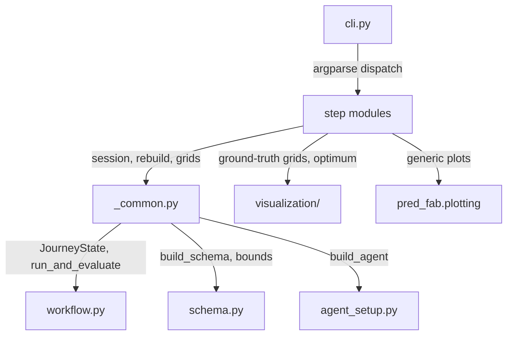

# steps/ — Context

## Purpose
One module per CLI command. `cli.py` only parses arguments and dispatches; each step is also runnable standalone (`python steps/baseline.py --n 5`).

## Structure

| Module | Description |
|---|---|
| `_common.py` | Shared infra: session load/save, `rebuild()`, axis specs, score grid, trust regions, console styles |
| `reset.py` | Clear all session state, data, and plots |
| `init_schema.py` | Create the session and show the problem schema |
| `init_agent.py` | Initialize the agent and show its state |
| `init_physics.py` | Randomize physics constants and show the ground-truth topology |
| `configure.py` | Set/show agent configuration (weights, bounds, trust regions, schedule, optimizer) |
| `baseline.py` | Run space-filling baseline experiments (no model) |
| `explore.py` | Run incremental exploration rounds (acquisition) |
| `analyse.py` | Ground truth vs prediction comparison; optional inline test-set metrics |
| `inference.py` | Single-shot inference with design intent |
| `adapt.py` | Online inference with layer-by-layer adaptation |
| `summary.py` | Run summary + journey plot across all phases |
| `report.py` | Visual report for one experiment |

## Key Points
- **Session file contract**: `.pfab_session.json` holds `config` + serialized `JourneyState`; steps share no in-memory state — every command reloads the session and `rebuild()` reconstructs agent + dataset + fab, reapplying the stored physics config and agent configuration.
- `predict_score_grid()` (`_common.py`) is the one predicted-combined-score grid over the schema's (water_ratio, print_speed) bounds; failed points become NaN with a single aggregate warning.
- **Trust regions derive from schema constraints**: default = bounds_span/10 per runtime parameter; `configure --trust-regions` overrides per key. The same regions feed scheduled trajectories and online adaptation deltas.
- Each step carries a one-line `sys.path` bootstrap so it resolves repo-root imports when run directly.
